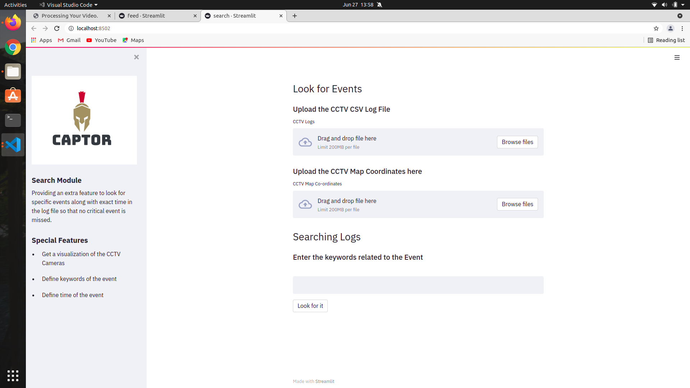

# Hawkeye

As the world advances in its journey towards automation and machine intelligence, equipping cutting-edge hardware with intelligent instincts grows in its importance. As intellect is for humans, software is for machines, hence we present an amalgamation of critically useful visionary skill sets for tracking, surveillance and unguided machine transportation. Autonomous unmanned ground vehicles comprise several technologies that allow the machine to be self-acting and self-regulating, sans human intervention.


### Prerequisites for Object Detection and Line crossing module
- **OpenVINO 2021.3**
  - If you haven't installed it, go to the OpenVINO web page and follow the [*Get Started*](https://software.intel.com/en-us/openvino-toolkit/documentation/get-started) guide to do it.  


### Required DL Models to Run The Object Detection and Line crossing module

 * For person / pedestrian detection and re-identification
   * `pedestrian-detection-adas-0002`
   * `person-reidentification-retail-0031`


You can download these models from OpenVINO [Open Model Zoo](https://github.com/opencv/open_model_zoo).
In the `models.lst` is the list of appropriate models for this demo that can be obtained via `Model downloader`.


To install all the required Python modules you can use:

``` sh
(Linux) pip3 install -r requirements.txt
(Win10) pip install -r requirements.txt
```


### Download DL models from OMZ
Use `Model Downloader` to download the required models and convert the downloaded model into OpenVINO IR models with `Model Converter`.  
``` sh
(Linux) python3 $INTEL_OPENVINO_DIR/deployment_tools/tools/model_downloader/downloader.py --list models.lst
(Win10) python "%INTEL_OPENVINO_DIR%\deployment_tools\tools\model_downloader\downloader.py" --list models.lst
```


### Download Model Checkpoints from here
Please download the <a href = "https://drive.google.com/file/d/1ZuUiUB6CK66lMxYHLra1pJ6Wp8MheWuH/view?usp=sharing">Model Checkpoints</a> and move the file to the <a href = "https://github.com/Aaditya188/Hawkeye/tree/main/CapTor/camera">camera</a> folder.


## HOW TO RUN THE WEBAPP
        
- Cloning the Repository: 

        git clone https://github.com/Aaditya188/Hawkeye.git
 
 - Run the Program: 

        python main.py
      
      
   
<h2 align= "left"><b>Website in a Print view</b></h2>

<p align="left">  

 &ensp;
 &ensp;
 &ensp;
 &ensp;
 &ensp;
 &ensp;
 &ensp;
 &ensp;
 &ensp;
 &ensp;


  
<h2 align= "left"><b>Demo Video and PPT Link 👇</b></h2>

- PPT Link : <a href="https://drive.google.com/file/d/1pHw6tbVb0efD2lVxOSQgtDGYAW5iomN4/view" target="_blank">PPTX</a>
- Youtube Proposal Video : <a href="https://youtu.be/jxtE5vglPfk">Video </a>

<br/> 

| Tech Stack    |  Usage |
| ------------- | ------- |
|   eJS,CSS,Bootstrap,HTML |  Front-End |
| Flask, Streamlit     | Deployment |
| OpenVino, NVIDIA CUDA |  Back-End |
